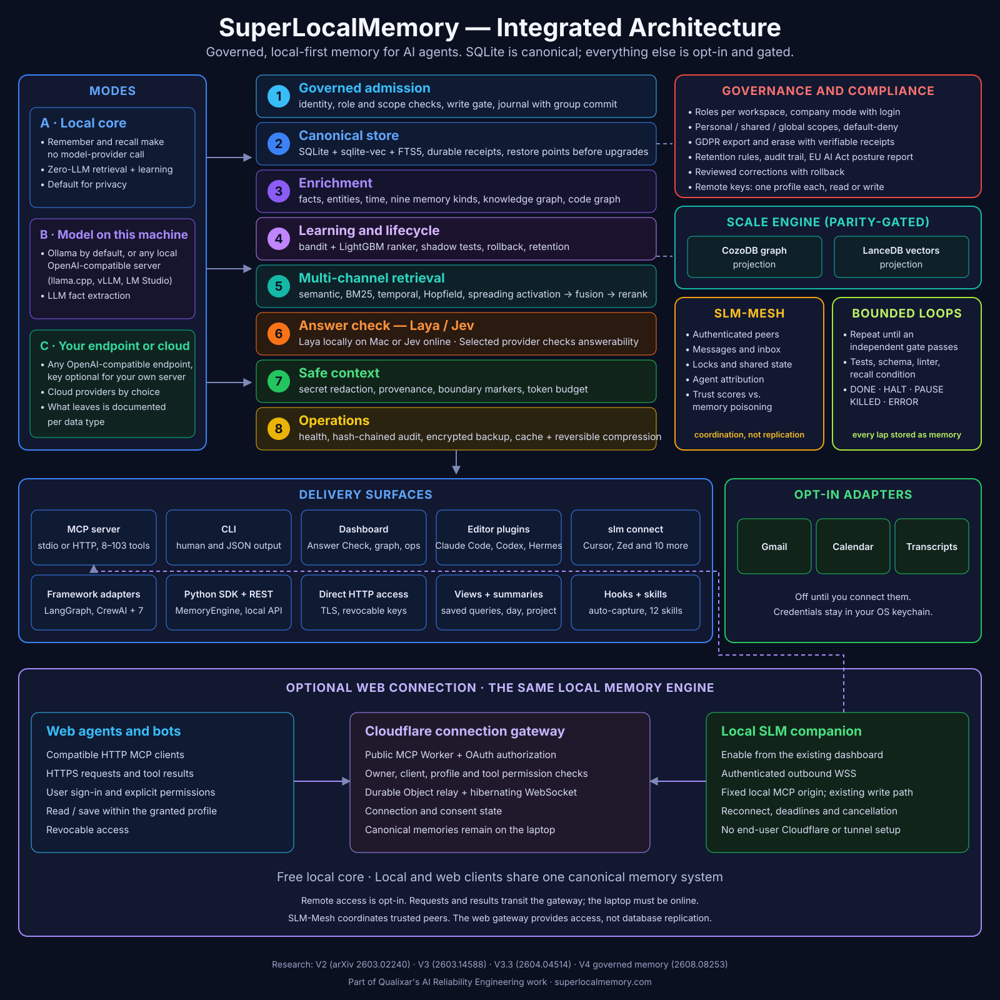

# Web access: use your memory from an app on the internet

SuperLocalMemory works fully on your computer. **Web access** is an optional
extra for one purpose: letting an AI app that runs on the internet, such as
ChatGPT, Claude on the web, Composio or Muse, recall from and (if you allow it)
save to the same memory your local agents use. It is off until you turn it on.

## What you need

- SLM installed and running on a computer that stays on and online while the
  app needs your memory. Your memory database stays on that computer and is
  never uploaded; a web app asks your computer a question and gets an answer
  back.
- A GitHub account, used to sign in. Local use (CLI, Claude Code, Codex, mesh)
  never needs it.
- An app that supports a custom remote MCP connection with OAuth sign-in.
  Whether your plan with that app allows one is up to the app.

## Turn it on

Open the dashboard (`slm dashboard`) and choose **Connected apps** under
**Integrations**. The page has three parts: **This computer** (the link between
your memory and the apps you add), **Your connected apps**, and **Set up an
app**. Setup takes four steps: choose the app, link this computer, check the
connection, add SLM to the app. [Connect an app](onboarding.md) walks through
them.

## What an app can do

When you link this computer you pick what the apps you add may do. Reading is
always included.

| Permission | What it allows | Tools |
|---|---|---|
| Read | Look things up in your memory | `recall`, `search`, `fetch`, `get_status` |
| Save | Remember new things | `remember` |
| Session tools | Open and close sessions and report whether a memory helped | `session_init`, `close_session`, `report_feedback`, `report_outcome` |

Saving and session tools are separate choices, off unless you tick them. An app
reaches one memory profile, the one active when you turn Web access on. It can
never delete, retire or correct a memory, share one with another profile, switch
profile or run any other tool. Those stay on your computer. The page lists each
connected app with the permissions it has, when it connected and when it was last
used, and **Remove access** ends that one app immediately.

Anything an app reads is shared with that app and with the AI service behind it,
and anything it saves travels to your computer through the connection. Treat it
like any other service you give access to.

## Instructions for the app

Access gives an app the tools, not the judgment about when to use them. Paste
the instructions from **Copy instructions** on the Connected apps page (or from
[Web agents](../web-agents/README.md)) into the app's instructions field.

## When it is not available

- **Your computer is asleep or offline.** Your computer sends a heartbeat after
  every 20 seconds of quiet. If the gateway has heard nothing for more than 45
  seconds it treats the computer as asleep, and the app gets `connector_asleep` instead of an answer.
  This is never reported as an empty recall. Wake the computer and the app can
  try again.
- **The free daily allowance is used up.** Web access has a free daily allowance
  of tool calls. When it is spent, apps get `DAILY_LIMIT_REACHED` until midnight
  UTC. Local use is never limited.
- **Too many calls at once.** A computer takes up to 8 web requests at a
  time; extras get `relay_busy`. One call at a time is enough.
- **A call takes too long.** A request has a 25-second deadline and returns
  `relay_timeout` if it passes.
- **Web access has ended or an app was removed.** The app gets `REVOKED` or
  `ENTITLEMENT_REQUIRED`.

If the gateway or your sign-in has a problem, only Web access is affected. Local
SLM keeps working.

## Renewal

Your computer holds a credential that lasts 30 days and renews itself in the
second half of its life, so normally you do nothing. The page shows **Renews
automatically**. If renewal has been failing and fewer than 7 days remain, it
says when Web access ends and asks you to check that the computer is online.
**Web access has ended** means you need to turn it on again, and **Sign in again
to keep Web access working** means GitHub sign-in lapsed. Each app's own sign-in
also lapses after 30 days without use; the app then signs in again.

## Turn it off

**Turn off** on the Connected apps page ends Web access for every app at once.
Your memory and local setup are not touched, and you can turn it on again.

## Documentation map

- [Connect an app](onboarding.md): the dashboard steps and what each state means.
- [Architecture and trust boundaries](architecture.md): components, data flow and authorization.
- [Web agents](../web-agents/README.md): copyable instructions for each kind of app.
- [Operator guide](cloudflare-operations.md): deploying the gateway (for operators, not users).
- [Checking a connection](acceptance.md): how to verify an app end to end.
- [Troubleshooting](../troubleshooting.md#web-access): fixes for common problems.
- [Local engine architecture](../ARCHITECTURE.md): the memory pipeline behind it.

Web access is not database replication and not SLM-Mesh. SLM's Jev answer-check
integration is separate from the Jev Decision Layer plugin.
